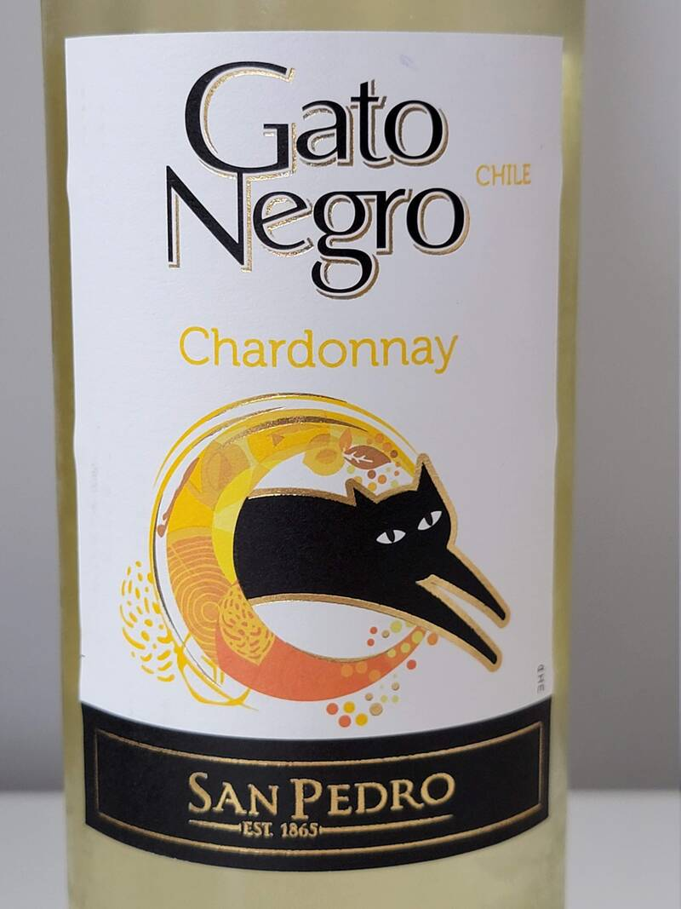
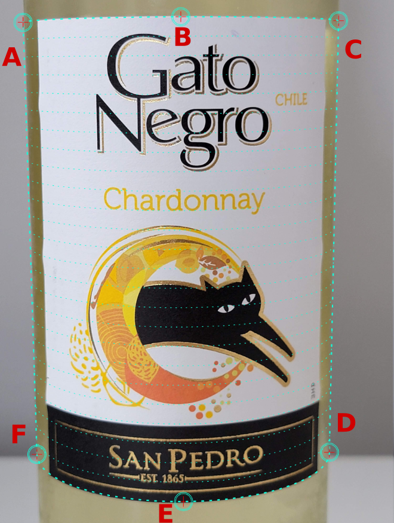
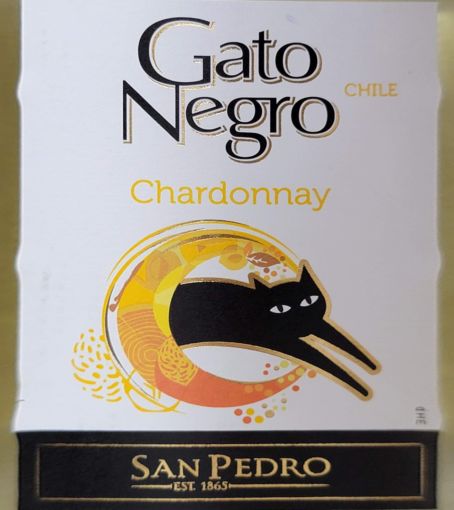
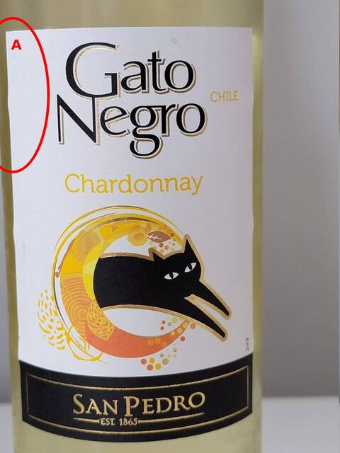
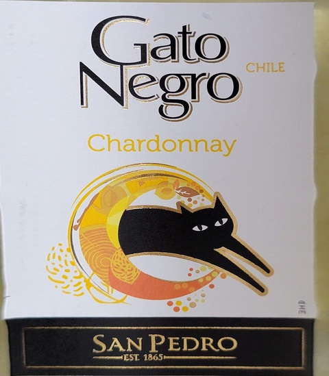

# Pictures Guide
It’s very important to take pictures properly to get the best 
unwrapping results.
Before digging in more details, let's discuss how unwrap 
works in general.
Here is an optimal picture of the label - it consumes 
the major part of the image, meanwhile neither label,
nor bottles left and right sides are cropped.

With that being said, the recognition service is able to calculate the surface geometry:

Please take into account, the cylinder edges start with the edges 
of the bottle (points A, C, D, F), even the paper label doesn't 
fully cover it, like in the example above. So, the proper photo 
shot must include all those 6 key points - it's a simple criteria 
to get a nice flat label, like in the picture below:

# Common Mistakes

One of the most common mistakes - the label region is not fully visible 
on the picture. Let’s take  look into an example, where an edge of the 
bottle is cropped:

Despite the left top edge of the label presents in the picture, 
the left side of the bottle is cropped, so the surface geometry 
will be distorted:

Despite the unwrapped image being close to the correct image, 
we can still observe a trapezoidal distortion in the left side 
of the image.

The picture below is cropped at the bottom (see point “E”). 

