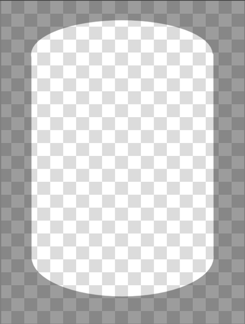

# Pictures Guide
It’s very important to take pictures properly to get the best 
unwrapping results.
Here is an optimal picture of the label - it consumes 
the major part of the image, meanwhile neither label,
nor left and right sides of the bottle are cropped.

With that being said, the recognition service is able to calculate the surface geometry:

Please take into account, the cylinder edges start with the edges 
of the bottle (points A, C, D, F), even the paper label doesn't 
fully cover it, like in the example above. So, the proper photo 
shot must include all those 6 key points - it's a simple criteria 
to get a nice flat label, like in the picture below:

## Common Mistakes
### Cropping Bottle Edge
One of the most common mistakes - cropping a side of the bottle.

Despite the left top edge of the label presents in the picture, 
it's not enough for proper geometry detection, which requires the entire width of 
the bottle to be visible.

The unwrapped image is close to the correct image, 
but we can still observe a trapezoidal distortion in the left side 
of the image.

### Cropping Top/Bottom Edge
The picture below is cropped at the bottom (see point “E”).

Despite the geometry is generally correct, the unwrapped label is cropped at
the bottom along the visible line:

### Too Large Image
It's not really an issue, but it will increase the latency pretty much. Usually there
is no need to use images larger than 1024x1024.

### Too Small Label
Another mistake - the label can be too small in the picture. It's recommended the label
consumes about 2/3 of image size. 

## Bottom Line
What to do, if labels come from regular users, that cannot be educated in advance? In that case,
it’s good to show a helper pattern, that will assist users to align the camera:

